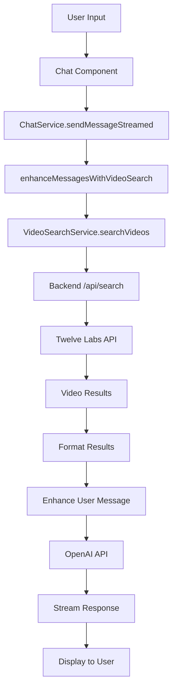

# 🏗️ 12labshackthon - Complete Architecture Documentation

## 🎯 High-Level System Design

### **System Overview**
Your AgenticRAG (Retrieval-Augmented Generation) system is a **video-powered AI chatbot** that combines:
- **Twelve Labs Video Intelligence API** for video understanding and search
- **OpenAI GPT models** for natural language processing
- **React frontend** with real-time chat interface
- **Node.js backend** as API proxy and middleware

### **Core Architecture Pattern**
```
User Query → Video Search → Context Enhancement → AI Response
```

### **System Components**

#### 1. **Frontend Layer (React + TypeScript)**
- **Chat Interface**: Real-time streaming chat with video context
- **Admin Dashboard**: Video management and configuration
- **Video Search Service**: Handles video search integration
- **Chat Service**: Orchestrates AI interactions with video context

#### 2. **Backend Layer (Node.js + Express)**
- **API Proxy**: Bridges frontend to Twelve Labs API
- **File Upload Handler**: Manages video uploads
- **Search Engine**: Processes video search requests
- **Status Monitoring**: Tracks video indexing progress

#### 3. **External Services**
- **Twelve Labs API**: Video intelligence and search
- **OpenAI API**: Language model for responses
- **Local Storage**: Client-side data persistence

---

## 🔧 Low-Level Technical Design

### **Data Flow Architecture**



### **Key Classes and Services**

#### **1. VideoSearchService.ts**
```typescript
class VideoSearchService {
  // Core video search functionality
  async searchVideos(query: string): Promise<VideoSearchResponse>
  
  // Video management
  isVideoSearchAvailable(): boolean
  getVideoInfo(videoId: string): VideoAsset | null
  
  // Result formatting
  formatSearchResults(results: VideoSearchResult[]): string
}
```

**Responsibilities:**
- Manages API key and index configuration
- Performs video searches via backend proxy
- Formats search results for AI consumption
- Handles video metadata and storage

#### **2. ChatService.ts**
```typescript
class ChatService {
  // Message enhancement with video context
  static async enhanceMessagesWithVideoSearch(messages: ChatMessage[]): Promise<ChatMessage[]>
  
  // AI communication
  static async sendMessageStreamed(chatSettings: ChatSettings, messages: ChatMessage[], callback: Function)
  
  // System prompt management
  static getSystemPromptWithVideoSearch(chatSettings: ChatSettings): string
}
```

**Responsibilities:**
- Orchestrates video search integration
- Enhances user messages with video context
- Manages streaming AI responses
- Handles system prompts and instructions

#### **3. Backend Server (server.js)**
```javascript
// Key endpoints
POST /api/search          // Video search
POST /api/tasks           // Video upload
GET  /api/tasks/:id       // Status checking
GET  /api/indexes/:id     // Index management
```

**Responsibilities:**
- Proxies requests to Twelve Labs API
- Handles CORS and authentication
- Manages file uploads and processing
- Provides status monitoring

---

## 🔄 Detailed Workflow Analysis

### **1. Video Upload and Indexing Process**

```typescript
// Admin Dashboard Flow
1. User uploads video file
2. Frontend sends to backend /api/tasks
3. Backend forwards to Twelve Labs API
4. Twelve Labs processes and indexes video
5. Frontend polls status until "ready"
6. Video becomes searchable
```

**Key Implementation Details:**
- **File Validation**: Type and size checking
- **Progress Tracking**: Real-time upload status
- **Error Handling**: Comprehensive error recovery
- **Status Polling**: Automatic completion detection

### **2. Video Search and Context Enhancement**

```typescript
// Chat Enhancement Flow
1. User sends message
2. ChatService.enhanceMessagesWithVideoSearch()
3. VideoSearchService.searchVideos()
4. Backend queries Twelve Labs API
5. Results formatted and added to message
6. Enhanced message sent to OpenAI
7. AI responds with video context
```

**Search Parameters:**
```javascript
{
  index_id: "user_index_id",
  query_text: "user_query",
  search_options: ["visual", "audio"],
  group_by: "video",
  threshold: "low"
}
```

### **3. AI Response Generation**

```typescript
// Response Enhancement
const enhancedMessage = VIDEO_SEARCH_USER_PROMPT_TEMPLATE(
  userQuery,
  formattedVideoResults
);

// System Prompt
const systemPrompt = getVideoSearchInstructions(hasVideos);
```

**Response Format:**
```
📹 [Video Title] (Confidence: XX%)
   ⏰ Time: MM:SS - MM:SS
   📝 Content: [Summary]
```

---

## 🗄️ Data Models and Storage

### **VideoAsset Interface**
```typescript
interface VideoAsset {
  id: string;              // Unique identifier
  title: string;           // Display name
  url: string;             // Video URL
  duration: number;        // Length in seconds
  thumbnail?: string;      // Preview image
  summary: string;         // Description
  indexed: boolean;        // Searchable status
  indexId?: string;        // Twelve Labs index
  videoId?: string;        // Twelve Labs video ID
  taskId?: string;         // Upload task ID
  uploadedAt: Date;        // Upload timestamp
  status: 'pending' | 'indexing' | 'ready' | 'failed';
}
```

### **VideoSearchResult Interface**
```typescript
interface VideoSearchResult {
  videoId: string;         // Twelve Labs video ID
  title: string;           // Video title
  confidence: number;      // Match confidence (0-1)
  startTime: number;       // Start timestamp
  endTime: number;         // End timestamp
  snippet: string;         // Content summary
  videoUrl?: string;       // Optional video URL
}
```

### **Storage Strategy**
- **localStorage**: Client-side video metadata and configuration
- **Twelve Labs Cloud**: Video files and search indices
- **Memory**: Runtime state and caching

---

## ⚙️ Configuration and Environment

### **Environment Configuration (env.json)**
```json
{
  "openapi_key": "sk-proj-...",
  "default_model": "gpt-4o",
  "TwLabs": "tlk_1EPBREV2HGMJHE23SREK60YJRX76"
}
```

### **Key Configuration Points**
1. **API Keys**: OpenAI and Twelve Labs authentication
2. **Model Selection**: GPT model for responses
3. **Search Options**: Visual, audio, text search modes
4. **Threshold Settings**: Confidence levels for results

---

## 🔍 Search and Retrieval Mechanics

### **Twelve Labs Integration**
```javascript
// Search Request Format
const formData = new FormData();
formData.append('index_id', indexId);
formData.append('query_text', query);
formData.append('search_options', 'visual,audio');
formData.append('group_by', 'video');
formData.append('threshold', 'low');
```

### **Search Capabilities**
- **Visual Search**: Objects, scenes, actions, people
- **Audio Search**: Spoken words, dialogue, sounds
- **Text Search**: Visible text in video frames
- **Logo Detection**: Brand and logo recognition

### **Result Processing**
```typescript
// Result Enhancement
data.data.forEach((videoGroup: any) => {
  const videoId = videoGroup.id;
  const matchedVideo = videos.find(v => v.videoId === videoId);
  
  videoGroup.clips.forEach((clip: any) => {
    results.push({
      videoId: videoId,
      title: matchedVideo?.title || `Video_${videoId.substring(0, 8)}`,
      confidence: clip.score / 100,
      startTime: Math.floor(clip.start),
      endTime: Math.floor(clip.end),
      snippet: `${clip.confidence} confidence - Score: ${clip.score.toFixed(1)}`
    });
  });
});
```

---

## 🚀 Performance and Scalability

### **Optimization Strategies**
1. **Debounced Streaming**: Prevents excessive API calls
2. **Result Caching**: Stores video metadata locally
3. **Progressive Loading**: Streams AI responses
4. **Error Recovery**: Graceful fallback mechanisms

### **Scalability Considerations**
- **Backend Proxy**: Handles CORS and rate limiting
- **Async Processing**: Non-blocking video indexing
- **Status Polling**: Efficient progress monitoring
- **Memory Management**: Proper cleanup and garbage collection

---

## 🔐 Security and Error Handling

### **Security Measures**
- **API Key Protection**: Stored in environment files
- **CORS Configuration**: Restricted cross-origin requests
- **Input Validation**: File type and size checking
- **Error Sanitization**: Safe error message handling

### **Error Handling Strategy**
```typescript
try {
  const videoResults = await VideoSearchService.searchVideos(query);
  // Process results
} catch (error) {
  console.error('Video search failed:', error);
  // Continue with original messages
  return messages;
}
```

---

## 📊 Monitoring and Debugging

### **Comprehensive Logging**
```typescript
console.log('🔍 Video search available:', isVideoSearchAvailable);
console.log('📹 Videos from Twelve Labs:', data);
console.log('✅ Converted videos:', syncedVideos);
```

### **Status Tracking**
- **Upload Progress**: Real-time percentage updates
- **Indexing Status**: Pending → Indexing → Ready
- **Search Results**: Confidence scores and timestamps
- **Error States**: Detailed error messages and recovery

---

## 🎯 Key Design Patterns

### **1. Service Layer Pattern**
- **VideoSearchService**: Encapsulates video operations
- **ChatService**: Manages AI interactions
- **NotificationService**: Handles user feedback

### **2. Proxy Pattern**
- **Backend Server**: Proxies external API calls
- **CORS Handling**: Manages cross-origin requests
- **Authentication**: Centralizes API key management

### **3. Observer Pattern**
- **Streaming Responses**: Real-time AI output
- **Status Updates**: Progress monitoring
- **Error Notifications**: User feedback system

### **4. Strategy Pattern**
- **Search Options**: Configurable search modes
- **Model Selection**: Different AI models
- **Response Formatting**: Flexible output formats

---

This comprehensive architecture provides a robust, scalable, and maintainable video-powered AI chatbot system that seamlessly integrates video intelligence with natural language processing! 🎬🤖
